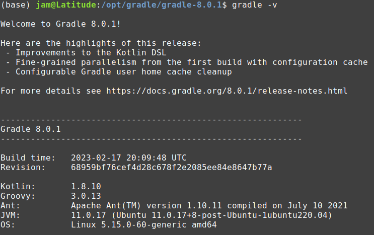

# CI/CD pipeline for docker images with Github Actions, Java and Gradle  

Automatiser l'ensemble du processus en utilisant un pipeline CI/CD avec Github Actions et Docker.  

## A. Installation de Gradle sous Linux  
[Source](https://gradle.org/install/)

### Step 1. Download the latest Gradle distribution:  

The current Gradle release is version 8.0.1, released on 17 Feb 2023. The distribution zip file comes in two flavors:

* [Binary-only](https://gradle.org/next-steps/?version=8.0.1&format=bin)
* [Complete](https://gradle.org/next-steps/?version=8.0.1&format=all), with docs and sources

### Step 2. Unpack the distribution: 

Unzip the distribution zip file in the directory of your choosing, e.g.:

```$ sudo mkdir /opt/gradle```  

```$ sudo unzip /opt/gradle gradle-8.0.1-bin.zip```  

```$ ls /opt/gradle/gradle-8.0.1```


### Step 3. Configure your system environment: 

Configure your PATH environment variable to include the bin directory of the unzipped distribution, e.g.:

```$ export PATH=$PATH:/opt/gradle/gradle-8.0.1/bin```

### Step 4. Verify your installation:  
Open a console and run gradle -v to run gradle and display the version, e.g.:

```$ gradle -v```  




## B. Building and testing Java with Gradle  
[Source] (https://docs.github.com/en/actions/automating-builds-and-tests/building-and-testing-java-with-gradle)

